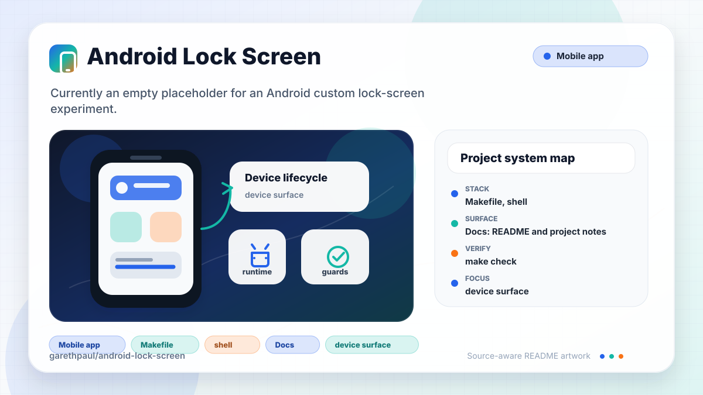

# android-lock-screen

<!-- README-OVERVIEW-IMAGE -->


## Overview

`garethpaul/android-lock-screen` is currently an empty placeholder for an
Android custom lock-screen experiment. No Android implementation, Gradle
project, tests, or app behavior have been committed yet.

No Gradle project is checked in yet. Do not add build, test, or install
commands until an Android project exists.

## Repository Contents

- `README.md` - project overview and local usage notes
- `CHANGES.md` - repository maintenance history
- `docs` - planning notes
- `scripts` - SDK-free repository checks
- `SECURITY.md` - security reporting and disclosure guidance
- `VISION.md` - project direction and contribution guardrails

## Future Baseline

Before app code is added, establish:

- A checked-in Gradle wrapper and Android Gradle Plugin version.
- Documented compile SDK, target SDK, and minimum SDK choices.
- A local test or source-check command that runs without device access.
- A build command that produces a debug APK in a configured Android SDK.
- CI or documented local gates for formatting, tests, and build verification.
- Ignore rules for generated Android artifacts and local SDK configuration.
- A permission and consent design note that covers Android version support,
  device-admin or device-owner behavior, background execution, and sensitive
  data handling before any lock-screen code is added. Use
  `docs/templates/lock-screen-permission-design.md` as the starting structure.

## Verify

Run the repository baseline check through the standard wrapper:

```sh
make check
```

or run the underlying SDK-free script directly:

```sh
scripts/check-baseline.sh
```

This check does not require an Android SDK because there is no Android project
to build yet.

## Security Baseline

Lock-screen implementation work must include a design note before code lands.
That note should explain the intended Android APIs, requested permissions,
user-consent flow, device-admin or device-owner assumptions, and manual
verification steps on supported Android versions. Start from
`docs/templates/lock-screen-permission-design.md` so the permission, data, and
rollback questions are answered consistently.

## Change Log

Repository maintenance changes are recorded in `CHANGES.md` until an Android
project exists with release notes or app-version metadata.
