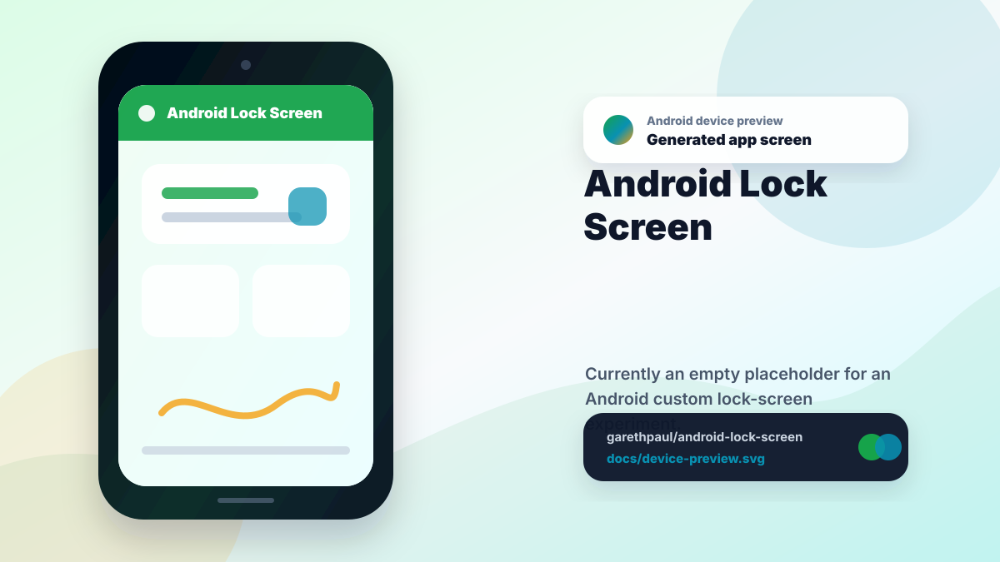

# android-lock-screen

<!-- README-OVERVIEW-IMAGE -->


## Device Preview

<!-- DEVICE-PREVIEW-IMAGE -->


## Overview

`garethpaul/android-lock-screen` is currently an empty placeholder for an
Android custom lock-screen experiment. No Android implementation, Gradle
project, tests, or app behavior have been committed yet.

No Gradle project is checked in yet. Do not add Gradle build, test, or install
commands until an Android project exists; the repository-level `make build`
target reports a skip for now.
The SDK-free baseline fails if Android implementation artifacts appear while
this empty-repository contract is still in force.

## Repository Contents

- `README.md` - project overview and local usage notes
- `CHANGES.md` - repository maintenance history
- `docs` - planning notes
- `scripts` - SDK-free repository checks
- `SECURITY.md` - security reporting and disclosure guidance
- `VISION.md` - project direction and contribution guardrails

## Future Baseline

Before app code is added, establish:

- A checked-in Gradle wrapper and Android Gradle Plugin version.
- Documented compile SDK, target SDK, and minimum SDK choices.
- A local test or source-check command that runs without device access.
- A build command that produces a debug APK in a configured Android SDK.
- CI or documented local gates for formatting, tests, and build verification.
- Ignore rules for generated Android artifacts and local SDK configuration.
- Replace the empty-repository baseline before adding Gradle files, Android
  source directories, or app scaffolding.
- A permission and consent design note that covers Android version support,
  device-admin or device-owner behavior, threat model, credential and
  biometric boundaries, accessibility-service boundaries,
  background-execution and direct-boot lifecycle boundaries,
  emergency and system UI invariants, overlay and input integrity boundaries,
  activity/task/component boundaries, platform ownership and capability
  boundaries, authentication-attempt handling boundaries, and sensitive data
  handling before any lock-screen code is added.
  Sensitive-data lifecycle boundaries must cover
  storage, encryption, cloud backup, device transfer, retention, deletion,
  restore validation, and production diagnostics. Use
  `docs/templates/lock-screen-permission-design.md` as the starting structure.

## Verify

GitHub Actions runs the same `make check` baseline through
`.github/workflows/check.yml` on pushes, pull requests, and manual dispatches.
The workflow uses immutable checkout, read-only permissions, and a five-minute
timeout. Its checkout credentials are not persisted after source retrieval.

Run the repository baseline check through the standard wrapper:

```sh
make check
```

The root Makefile also exposes the pre-push gate names:

```sh
make lint
make test
make build
```

`make build` does not produce an APK yet; it reports that no Android project is
checked in and exits successfully.

or run the underlying SDK-free script directly:

```sh
scripts/check-baseline.sh
```

This check does not require an Android SDK because there is no Android project
to build yet. It also fails if Android implementation artifacts appear before
the empty-repository baseline is replaced.

## Security Baseline

Lock-screen implementation work must include a design note before code lands.
That note should explain the intended Android APIs, requested permissions,
user-consent flow, device-admin or device-owner assumptions, threat model,
credential and biometric boundaries, accessibility-service boundaries,
emergency and system UI invariants, overlay and input integrity boundaries,
activity/task/component boundaries, and manual verification steps on supported
Android versions. Start from
`docs/templates/lock-screen-permission-design.md` so the permission, data, and
rollback questions are answered consistently.
The design note must include credential and biometric boundaries before any
authentication-adjacent UI or behavior is added.
Authentication-attempt handling boundaries must define throttling, durable
attempt state, time semantics, concurrent attempts, reset conditions,
diagnostic redaction, and non-destructive recovery.
It must also define sensitive-data lifecycle boundaries before any lock-state,
account, device, or diagnostic data is persisted or transmitted.
Future background components must document direct-boot storage, foreground
disclosure, restart and cancellation rules, denied startup, and a disable path
that cannot silently resurrect the feature.

## Change Log

Repository maintenance changes are recorded in `CHANGES.md` until an Android
project exists with release notes or app-version metadata.

The CI baseline is documented in
`docs/plans/2026-06-10-ci-baseline.md`.
